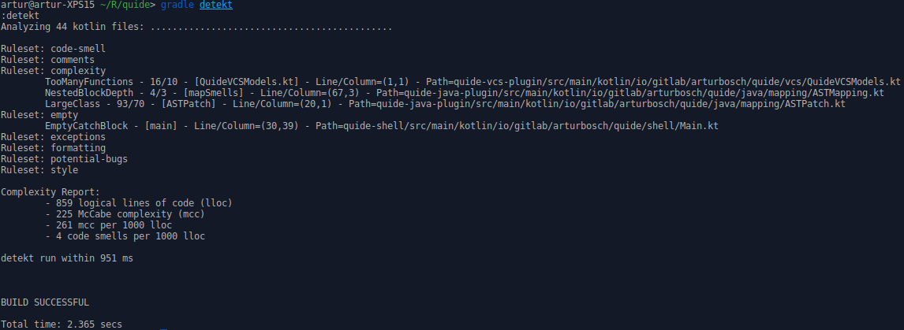

# __detekt__

[](https://gitlab.com/arturbosch/detekt/commits/master)
[](https://github.com/KotlinBy/awesome-kotlin)
[  ](https://bintray.com/arturbosch/code-analysis/detekt/_latestVersion)

Meet _detekt_, a static code analysis tool for the _Kotlin_ programming language.
It operates on the abstract syntax tree provided by the Kotlin compiler.


### Features

- code smell analysis for your kotlin projects
- complexity report based on logical lines of code, McCabe complexity and amount of code smells
- highly configurable (rule set or rule level)
- suppress findings with Kotlin's @Suppress and Java's @SuppressWarnings annotations
- specify code smell thresholds to break your build or print a warning
- extensible by own rule sets and `FileProcessListener's`
- format your code with the formatting rule set
- code Smell baseline and ignore lists for legacy projects
- **NEW** - [gradle plugin](#gradleplugin) for code analysis, formatting and import migration


### Table of contents
1. [Usage/Build](#build)
2. [Parameters for CLI](#cli)
3. [As gradle plugin](#gradleplugin)
3. [As gradle task](#gradle)
4. [As maven task](#maventask)
5. [Rule sets](#rulesets)
6. [Rule set configuration](#rulesetconfig)
7. [Suppress rules](#suppress)
7. [Build failure](#failure)
7. [Custom rule sets](#customruleset)
8. [Rule testing](#testing)
9. [Formatting - Code Style](#formatting)
10. [Black- and Whitelist code smells](#baseline)

### <a name="build">Usage/Build</a>

##### Building all submodules ( + executables)

- cd detekt
- gradle clean build (install shadow)

##### Using the command line interface

- cd detekt-cli
- gradle shadow
- java -jar build/libs/detekt-cli-[version]-all.jar

#### <a name="cli">Parameters for CLI</a>
The CLI uses jcommander for argument parsing.

```
The following option is required: --project, -p

Usage: detekt [options]
  Options:
    --baseline, -b
      Treats current analysis findings as a smell baseline for further detekt
      runs. If a baseline xml file exists, only new code smells not in the
      baseline are printed in the console.
      Default: false
    --config, -c
      Path to the config file (path/to/config.yml).
    --config-resource, -cr
      Path to the config resource on detekt's classpath (path/to/config.yml).
    --debug, -d
      Debugs given ktFile by printing its elements.
      Default: false
    --disableDefaultRuleSets, -dd
      Disables default rule sets.
      Default: false
    --filters, -f
      Path filters defined through regex with separator ';' (".*test.*").
    --format
      Enables formatting of source code. Cannot be used together with
      --config.
      Default: false
    --help, -h
      Shows the usage.
    --output, -o
      True if findings should be written into a report.detekt file inside the
      report folder.
      Default: false
    --parallel
      Enables parallel compilation of source files. Should only be used if the
      analyzing project has more than ~200 kotlin files.
      Default: false
  * --project, -p
      Project path to analyze (path/to/project).
    --report, -rp
      Path to the report directory where findings should be stored (if
      --output) and baseline.xml generated (if --baseline).
    --rules, -r
      Extra paths to ruleset jars separated by ';'.
    --useTabs
      Tells the formatter that indentation with tabs are valid.
      Default: false
```

`project` can either be a directory or a single Kotlin file.
The currently only supported configuration format is yaml. `config` should point to one.
`filters` can be used for example to exclude all test directories.
With `rules` you can point to additional ruleset.jar's creating by yourself or others. 
More on this topic see section _Custom RuleSets_.

The `report` parameter is optional and when used, it should point to


#### <a name="gradleplugin">Using the detekt-gradle-plugin</a>


```groovy
buildscript {
    repositories {
        // As of 1.0.0.M10.1 detekt is published to jcenter
        // if it does not work yet properly add my bintray repo:
        maven { url "http://dl.bintray.com/arturbosch/code-analysis" }
    }
}

plugins {
    // DO NOT USE EARLIER VERSIONS
    // gradle-plugin versioning will later be independent of detekt version
    id "io.gitlab.arturbosch.detekt" version "1.0.0.M10.2"
}

detekt {
    version = "1.0.0.M10.1"  // Specify current detekt version
    input = "$input/src/main/kotlin" // input is preconfigured to 'project.projectDir.absolutePath'
    config = "$project.projectDir/detekt.yml" // Use $project.projectDir to navigate inside your project 
    filters = ".*test.*, .*/resources/.*" // What paths to exclude? Use comma oder semicolon to separate
    rulesets = "other/optional/ruleset.jar" // Custom rule sets can be linked to this, use comma oder semicolon to separate 
}
```

Now three new tasks are available: 
- `detekt` - runs normal detekt analysis and complexity report
- `detektFormat` - formats your kotlin code, needs `config` parameter (see [Formatting - Code Style](#formatting))
- `detektMigrate` - migrates imports, needs `config` parameter (experimental)

##### Migration

Migration rules can be configured in your `detekt.yml` file. For now only migration of imports is supported.

```yaml
# *experimental feature*
# Migration rules can be defined in the same config file or a new one
migration:
  active: true
  imports:
    # your.package.Class: new.package.or.Class
    # for example:
    # io.gitlab.arturbosch.detekt.api.Rule: io.gitlab.arturbosch.detekt.rule.Rule
```

#### <a name="gradle">Using detekt in custom gradle projects</a>

1. Add following lines to your build.gradle file.
2. Run `gradle detekt`
3. Add `check.dependsOn detekt` if you want to run detekt on every `build`

```groovy
repositories {
    // if you 'gradle install' all detekt modules
	mavenLocal()
	// or when all modules should be provided
	maven {
        url  "http://dl.bintray.com/arturbosch/code-analysis"
    }
}

configurations {
	detekt
}

task detekt(type: JavaExec) {
	main = "io.gitlab.arturbosch.detekt.cli.Main"
	classpath = configurations.detekt
	def input = "$project.projectDir.absolutePath"
	def config = "$project.projectDir/detekt.yml"
	def filters = ".*test.*"
	def rulesets = ""
	def params = [ '-p', input, '-c', config, '-f', filters, '-r', rulesets]
	args(params)
}

dependencies {
	detekt 'io.gitlab.arturbosch.detekt:detekt-cli:1.0.0.[CURRENT_MILESTONE]'
	detekt 'io.gitlab.arturbosch.detekt:detekt-formatting:1.0.0.[CURRENT_MILESTONE]'
}
```

`Attention Android Developers! the dependencies section must be at the bottom, after the repository, configurations and task sections!`



#### <a name="maventask">Using detekt in Maven Projects</a>

1. Add following lines to your pom.xml.
2. Run `mvn verify` (when using the verify phase as I did here)


```xml
<build>
    <plugins>
        <plugin>
            <groupId>org.apache.maven.plugins</groupId>
            <artifactId>maven-antrun-plugin</artifactId>
            <version>1.8</version>
            <executions>
                <execution>
                    <!-- This can be run separately with mvn antrun:run@detekt -->
                    <id>detekt</id>
                    <phase>verify</phase>
                    <configuration>
                        <target name="detekt">
                            <java taskname="detekt" dir="${basedir}" fork="true" failonerror="true"
                                  classname="io.gitlab.arturbosch.detekt.cli.Main" classpathref="maven.plugin.classpath">
                                <arg value="-p"/>
                                <arg value="${basedir}/src"/>
                                <arg value="-f"/>
                                <arg value=".*test.*"/>
                                <arg value="--useTabs"/>
                            </java>
                        </target>
                    </configuration>
                    <goals><goal>run</goal></goals>
                </execution>
            </executions>
            <dependencies>
                <dependency>
                    <groupId>io.gitlab.arturbosch.detekt</groupId>
                    <artifactId>detekt-cli</artifactId>
                    <version>1.0.0.[CURRENT_MILESTONE]</version>
                </dependency>
            </dependencies>
        </plugin>
    </plugins>
</build>

<pluginRepositories>
  <pluginRepository>
    <id>arturbosch-code-analysis</id>
    <name>arturbosch-code-analysis (for detekt)</name>
    <url>https://dl.bintray.com/arturbosch/code-analysis/</url>
    <layout>default</layout>
    <releases>
      <enabled>true</enabled>
      <updatePolicy>never</updatePolicy>
    </releases>
    <snapshots>
      <enabled>false</enabled>
      <updatePolicy>never</updatePolicy>
    </snapshots>
  </pluginRepository>
</pluginRepositories>
```

### <a name="rulesets">RuleSets</a>

Currently there are seven rule sets which are used per default when running the cli.

- complexity    - has rules to detect _LongMethod, LongParameterList, LargeClass, ComplexMethod ..._ smells
- code-smell    - other rules which can be classified as code smells but do not fit into the complexity category
- style         - detects wildcard imports and naming violations
- comments      - has rules to detect missing KDoc over public members and unnecessary KDoc over private members
- exceptions    - too general exceptions are used in throw and catch statements like RuntimeException, Error or Throwable
- empty         - finds empty block statements
- potential-bugs    - code is structured in a way it can lead to bugs like 'only equals but not hashcode is implemented' or explicit garbage
 collection calls

##### Additional RuleSets 

* formatting: detects indentation, spacing problems and optional semicolons in code

As of milestone six, the formatting rule set is shipped as an standalone plugin which must be linked to a detekt run
through the --rules "path/to/jar" parameter or via gradle/maven classpath setup.

### <a name="rulesetconfig">RuleSet Configuration</a>

To turn off specific rules/rule sets or change threshold values for certain rules a yaml configuration file can be used.
Copy and modify the `default-detekt-config.yml` from the detekt folder for your needs.

```yml
code-smell:
  LongMethod:
    active: true
    threshold: 20
  LongParameterList:
    active: false
    threshold: 5
  LargeClass:
    active: false
    threshold: 70
  ...

style:
  active: true
  ...

comments:
  active: false
```

```yaml
autoCorrect: true
formatting:
  ConsecutiveBlankLines:
    autoCorrect: true
  ...
```

Every rule of the default rule sets can be turned off. Thresholded code-smell rules can have an additional field `threshold`.
`Formatting` rules can be configured to `autoCorrect` the style mistake.

`Active` keyword is only needed if you want to turn off the rule. `Active` on the rule set level turn off whole rule set.
`autoCorrect` on the top level must be set to true or else all configured formatting rules are ignored.
This is done to prevent you from changing your project files if your not 100% sure about it.

### <a name="suppress">Suppress code smell rules</a>

detekt supports the Java (`@SuppressWarnings`) and Kotlin (`@Suppress`) style suppression. If both annotations are present, only Kotlin's annotation is used! To suppress a rule, the id of the rule must be written inside the values field of the annotation e.g. `@Suppress("LongMethod", "LongParameterList", ...)`

### <a name="failure">Configure build failure thresholds</a>

detekt now can throw a BuildFailure(Exception) and let the build fail with following config parameters:
```yaml
build:
  warningThreshold: 5
  failThreshold: 10
  weights:
    code-smell: 2
    LongParameterList: 1
```

Every rule and rule set can be attached with an integer value which is the weight of the finding.
For example: If you have 5 findings of the category _code-smell_, then your failThreshold of 10 is reached as
5 x 2 = 10. 

The formula for weights: RuleID > RuleSetID > 1 

### <a name="customruleset">Custom RuleSets</a>

_detekt_ uses a ServiceLoader to collect all instances of _RuleSetProvider_-interfaces. So it is possible
to define rules/rule sets and enhance detekt with your own flavor. 
Attention: You need a `resources/META-INF/services/io.gitlab.arturbosch.detekt.api.RuleSetProvider` file which 
has as content the fully qualified name of your RuleSetProvider e.g. _io.gitlab.arturbosch.detekt.sampleruleset.SampleProvider_.

The easiest way to define an rule set is to clone the provided detekt-sample-ruleset project.

Own rules have to extend the abstract _Rule_ class and override the `visitXXX` functions from the AST.
A `RuleSetProvider` must be implemented which declares a `RuleSet` in the `instance` method.
To allow your rule to be configurable, pass it a Config object from within your rule set provider.
You can also specify a _Severity_ type for your rule.

Example of a custom rule:
```kotlin
class TooManyFunctions : Rule("TooManyFunctions") {

	private var amount: Int = 0

	override fun visitFile(file: PsiFile) {
		super.visitFile(file)
		if (amount > 10) {
			addFindings(CodeSmell(id, Entity.from(file)))
		}
	}

	override fun visitNamedFunction(function: KtNamedFunction) {
		amount++
	}

}
```

Example of a much preciser rule in terms of more specific CodeSmell constructor and Rule attributes:
```kotlin
class TooManyFunctions2(config: Config) : Rule("TooManyFunctionsTwo", Severity.Maintainability, config) {

	private var amount: Int = 0

	override fun visitFile(file: PsiFile) {
		super.visitFile(file)
		if (amount > 10) {
			addFindings(CodeSmell(
					id = id, entity = Entity.from(file),
					description = "Too many functions can make the maintainability of a file more costly",
					metrics = listOf(Metric(type = "SIZE", value = amount, threshold = 10)),
					references = listOf())
			)
		}
	}

	override fun visitNamedFunction(function: KtNamedFunction) {
		amount++
	}

}
```

If you want your rule to be configurable, write down your properties inside the detekt.yml file
 and use the `withConfig` function:

```yaml
MyRuleSet:
  MyRule:
    MyMetric: 5
    threshold: 10
  OtherRule:
    active: false
```

By specifying the rule set and rule ids, detekt will use the sub configuration of MyRule:

```val threshold = withConfig { valueOrDefault("threshold") { threshold } }```

#### Maven

If your using maven to build rule sets or use detekt as a dependency, you have to run the additional task `install`

#### <a name="testing">Testing your rules</a>

To test your rules you need a KtFile object and use it's _visit_ method.
There are two predefined methods to help obtaining a KtFile:

- compileContentForTest(content: String): KtFile
- compileForTest(path: Path): KtFile

New with M3 there is a special detekt-test module, which specifies above two methods but also
Rule extension functions that allow allow to skip compilation, ktFile and visit procedures.

- Rule.lint(StringContent/Path) returns just the findings for given content
- Rule.format(StringContent/Path) returns just the new modified content for given content

### <a name="formatting">Formatting</a>

[KtLint](https://github.com/shyiko/ktlint) was first to support auto correct formatting according to the kotlin [coding conventions](https://kotlinlang.org/docs/reference/coding-conventions.html).
In Detekt I made an effort to port over all available formatting rules to detect style violations and auto correct them.

Following configuration I use to check the style for `detekt`. If your like me who prefer tabs over spaces, use `useTabs` in the
rule set level to turn off indentation check for spaces (or simple turn off `Indentation` rule).

```yaml
autoCorrect: true
formatting:
  active: true
  useTabs: true
  Indentation:
    active: false
    autoCorrect: false
  ConsecutiveBlankLines:
    active: true
    autoCorrect: true
  MultipleSpaces:
    active: true
    autoCorrect: true
  SpacingAfterComma:
    active: true
    autoCorrect: true
  SpacingAfterKeyword:
    active: true
    autoCorrect: true
  SpacingAroundColon:
    active: true
    autoCorrect: true
  SpacingAroundCurlyBraces:
    active: true
    autoCorrect: true
  SpacingAroundOperator:
    active: true
    autoCorrect: true
  TrailingSpaces:
    active: true
    autoCorrect: true
  UnusedImports:
    active: true
    autoCorrect: true
```

### <a name="baseline">Code Smell baseline and ignore list</a>

Specify a report directory with `--report` parameter.
 
Now with --output you can generate a `report.detekt` inside your
report directory which holds all findings of current analysis.

With `--baseline` you generate a `baseline.xml` where code smells are white- or blacklisted.

```xml
<SmellBaseline>
    <Blacklist timestamp="1483388204705">
        <ID>CatchRuntimeException:Junk.kt$e: RuntimeException</ID>
    </Blacklist>
    <Whitelist timestamp="1483446226153">
        <ID>NestedBlockDepth:OptionalSemicolon.kt$OptionalSemicolon$override fun procedure(node: ASTNode)</ID>
        <ID>NestedBlockDepth:Indentation.kt$Indentation$override fun procedure(node: ASTNode)</ID>
        <ID>EmptyFunctionBlock:Rule.kt$Rule${ }</ID>
        <ID>NoElseInWhenExpression:ExplicitGarbageCollectionCall.kt$ExplicitGarbageCollectionCall$when (it.text) { "System", "Runtime.getRuntime()" -&gt; addFindings(CodeSmell(id, Entity.Companion.from(expression))) }</ID>
        <ID>NamingConventionViolation:TooManyFunctions2.kt$TooManyFunctions2 : Rule</ID>
    </Whitelist>
</SmellBaseline>
```

The intention of a whitelist is that only new code smells are printed on further analysis. The blacklist can be used
to write down false positive detections. The `ID` node must be build of `<RuleID>:<Signature>`. Both values can be found
inside the `report.detekt` file.
