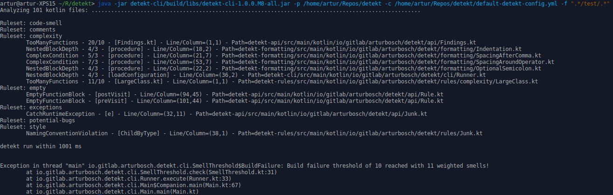

# __detekt__

[](https://travis-ci.org/arturbosch/detekt)
[](https://github.com/KotlinBy/awesome-kotlin)
[  ](https://bintray.com/arturbosch/code-analysis/detekt/_latestVersion)

Meet _detekt_, a static code analysis tool for the _Kotlin_ programming language.
It operates on the abstract syntax tree provided by the Kotlin compiler.



### Features

- code smell analysis for your kotlin projects
- complexity report based on logical lines of code, McCabe complexity and amount of code smells
- highly configurable (rule set or rule level)
- suppress findings with Kotlin's @Suppress and Java's @SuppressWarnings annotations
- specify code smell thresholds to break your build or print a warning
- extensible by own rule sets and `FileProcessListener's`
- format your code with the formatting rule set
- code Smell baseline and ignore lists for legacy projects
- **NEW** - [gradle plugin](#gradleplugin) for code analysis, formatting and import migration


### Table of contents
1. [Commandline interface](#build)
2. [Gradle plugin](#gradleplugin)
    1. [in groovy dsl](#gradlegroovy)
    2. [in kotlin dsl](#gradlekotlin)
    3. [plugin tasks](#tasks)
    4. [detekt-closure](#closure)
3. [Standalone gradle task](#gradle)
4. [Standalone maven task](#maventask)
5. [Rule sets](#rulesets)
6. [Rule set configuration](#rulesetconfig)
7. [Suppress rules](#suppress)
7. [Build failure](#failure)
7. [Custom rule sets](#customruleset)
    1. [Rule testing](#testing)
9. [Formatting - Code Style](#formatting)
10. [Black- and Whitelist code smells](#baseline)
10. [Contributors](#contributors)

### <a name="build">Build & use the commandline interface</a>

- `git clone https://github.com/arturbosch/detekt`
- `cd detekt`
- `./gradlew build shadow`
- `java -jar detekt-cli/build/libs/detekt-cli-[version]-all.jar [parameters]*`

##### Parameters for CLI
The CLI uses jcommander for argument parsing. Following parameters are shown when `--help` is entered:

```
The following option is required: --project, -p

Usage: detekt [options]
  Options:
    --baseline, -b
      Treats current analysis findings as a smell baseline for further detekt
      runs. If a baseline xml file is passed in, only new code smells not in
      the baseline are printed in the console.
    --config, -c
      Path to the config file (path/to/config.yml).
    --config-resource, -cr
      Path to the config resource on detekt's classpath (path/to/config.yml).
    --debug, -d
      Debugs given ktFile by printing its elements.
      Default: false
    --disable-default-rulesets, -dd
      Disables default rule sets.
      Default: false
    --filters, -f
      Path filters defined through regex with separator ';' (".*test.*").
    --format
      Enables formatting of source code. Cannot be used together with
      --config.
      Default: false
    --generate-config, -gc
      Export default config to default-detekt-config.yml.
      Default: false
    --help, -h
      Shows the usage.
    --output, -o
      Specify the file to output to.
      Default: reports/detekt.xml
    --parallel
      Enables parallel compilation of source files. Should only be used if the
      analyzing project has more than ~200 kotlin files.
      Default: false
  * --project, -p
      Project path to analyze (path/to/project).
    --rules, -r
      Extra paths to ruleset jars separated by ';'.
    --useTabs
      Tells the formatter that indentation with tabs are valid.
      Default: false
```

`project` can either be a directory or a single Kotlin file.
The currently only supported configuration format is yaml. `config` should point to one.
`filters` can be used for example to exclude all test directories.
With `rules` you can point to additional ruleset.jar's creating by yourself or others. 
More on this topic see section _Custom RuleSets_.

#### <a name="gradleplugin">Using the detekt-gradle-plugin</a>

Use the groovy or kotlin dsl of gradle and configure the detekt closure as described [here](#closure).

##### <a name="gradlegroovy">Configuration when using groovy dsl</a>
For gradle version >= 2.1
 
```groovy
buildscript {
    repositories {
        jcenter()
    }
}

plugins {
    id "io.gitlab.arturbosch.detekt" version "1.0.0.[version]"
}

detekt {
    version = "1.0.0.[version]"
    input = "$input/src/main/kotlin"
    config = "project.projectDir/detekt.yml" 
    filters = ".*test.*,.*/resources/.*,.*/tmp/.*"
}
```

For all gradle versions:

```groovy
buildscript {
  repositories {
    jcenter
    maven { url "https://plugins.gradle.org/m2/" }
  }
  dependencies {
    classpath "gradle.plugin.io.gitlab.arturbosch.detekt:detekt-gradle-plugin:1.0.0.[version]"
  }
}

apply plugin: "io.gitlab.arturbosch.detekt"

detekt {
    version = "1.0.0.[version]"
    input = "$input/src/main/kotlin"
    config = "$project.projectDir/detekt.yml"
    filters = ".*test.*,.*/resources/.*,.*/tmp/.*"
}
```

##### <a name="gradlekotlin">Configuration when using kotlin dsl</a>
For gradle version >= 3.5

```kotlin
import io.gitlab.arturbosch.detekt.DetektExtension

buildscript {
    repositories {
        jcenter()
    }
}
plugins {
    id("io.gitlab.arturbosch.detekt").version("1.0.0.[version]")
}

configure<DetektExtension> {
    version = "1.0.0.[version]"
    input = "$input/src/main/kotlin"
    config = "${project.projectDir}/detekt.yml"
    filters = ".*test.*,.*/resources/.*,.*/tmp/.*"
}
```

#### <a name="tasks">Available plugin tasks</a>

- `detektCheck` - Runs a _detekt_ analysis and complexity report. Configure the analysis inside the `detekt-closure`. By default the standard rule set is used without output report or  black- and whitelist checks.
- `detektGenerateConfig` - Generates a default detekt config file into your projects location.
- `detektFormat` - Formats your kotlin code by using the formatting rule set. Specify which rules should be turned on/off and which should be auto corrected. (see [Formatting - Code Style](#formatting)). Pay attention that this formatting rule set is not as powerful as `intellij's inspection` and never will be. It is recommend to use the `detektIdeaFormat` task which needs some pre configurations.
- `detektMigrate` - Experimental feature for now. Just supports migration of specified imports. See [migration section](#migration).
- `detektIdeaFormat` - Uses a local `idea` installation to format your kotlin (and other) code according to the specified `code-style.xml`.
- `detektIdeaInspect` Uses a local `idea` installation to run inspections on your kotlin (and other) code according to the specified `inspections.xml` profile.

##### Configure a local idea for detekt

- download the community edition of [intellij](https://www.jetbrains.com/idea/download/)
- extract the file to your preferred location eg. `~/.idea`
- let detekt know about idea inside the `detekt-closure`
- extract `code-style.xml` and `inpect.xml` from idea settings (`Settings>CodeStyle>Scheme` and `Settings>Inspections>Profile`)
- run `detektIdeaFormat` or `detektIdeaInspect`
- all parameters in the following detekt-closure are mandatory for both tasks

```groovy
String USER_HOME = System.getProperty("user.home")

detekt {    
    input = "$input/src/main/kotlin"
    report = "$input/reports"
    idea {
        path = "$USER_HOME/.idea"
        codeStyleScheme = "$USER_HOME/.idea/idea-code-style.xml"
        inspectionsProfile = "$USER_HOME/.idea/inspect.xml"
        mask = "*.kt,"
    }
}
```

For more information on using idea as a headless formatting/inspection tool see [here](https://www.jetbrains.com/help/idea/working-with-intellij-idea-features-from-command-line.html).

##### <a name="closure">Options for detekt configuration closure</a>

```groovy
detekt {
    version = "1.0.0.[version]"  // Specify latest detekt version, when unspecified plugins default version is used
    input = "$input/src/main/kotlin" // input is pre configured to 'project.projectDir.absolutePath'
    config = "$project.projectDir/detekt.yml" // Use $project.projectDir or to navigate inside your project 
    configResource = "/detekt.yml" // Use this parameter instead of config if your detekt yaml file is inside your resources. Is needed for multi project maven tasks.
    filters = ".*test.*, .*/resources/.*" // What paths to exclude? Use comma oder semicolon to separate
    rulesets = "other/optional/ruleset.jar" // Custom rule sets can be linked to this, use comma oder semicolon to separate, remove if unused.
    disableDefaultRuleSets = false // Disables the default rule set. Just use detekt as the detection engine with your custom rule sets.
    output = "$project.projectDir/reports/detekt.xml" // If present, prints all findings into that file.
    baseline = "$project.projectDir/reports/baseline.xml" // If present all current findings are saved in a baseline.xml to only consider new code smells for further runs.
    parallel = true // Use this flag if your project has more than 200 files. 
    useTabs = false // Turns of indentation check for spaces if true, default is false and does not need to be specified
    generateConfig = true // Use this flag to generate a default configuration yaml file which can be used for further tuning detekt. Remove this after the generation
}
```

##### <a name="migration">Migration</a>

Migration rules can be configured in your `detekt.yml` file. For now only migration of imports is supported.

```yaml
# *experimental feature*
# Migration rules can be defined in the same config file or a new one
migration:
  active: true
  imports:
    # your.package.Class: new.package.or.Class
    # for example:
    # io.gitlab.arturbosch.detekt.api.Rule: io.gitlab.arturbosch.detekt.rule.Rule
```

#### <a name="gradle">Using _detekt_ in custom gradle projects</a>

1. Add following lines to your build.gradle file.
2. Run `gradle detekt`
3. Add `check.dependsOn detekt` if you want to run _detekt_ on every `build`

```groovy
repositories {
    jcenter()
}

configurations {
	detekt
}

task detekt(type: JavaExec) {
	main = "io.gitlab.arturbosch.detekt.cli.Main"
	classpath = configurations.detekt
	def input = "$project.projectDir.absolutePath"
	def config = "$project.projectDir/detekt.yml"
	def filters = ".*test.*"
	def rulesets = ""
	def params = [ '-p', input, '-c', config, '-f', filters, '-r', rulesets]
	args(params)
}

dependencies {
	detekt 'io.gitlab.arturbosch.detekt:detekt-cli:1.0.0.[version]'
	detekt 'io.gitlab.arturbosch.detekt:detekt-formatting:1.0.0.[version]'
}
```

`Attention Android Developers! the dependencies section must be at the bottom, after the repository, configurations and task sections!`

#### <a name="maventask">Using _detekt_ in Maven Projects</a>

1. Add following lines to your pom.xml.
2. Run `mvn verify` (when using the verify phase as I did here)


```xml
<build>
    <plugins>
        <plugin>
            <groupId>org.apache.maven.plugins</groupId>
            <artifactId>maven-antrun-plugin</artifactId>
            <version>1.8</version>
            <executions>
                <execution>
                    <!-- This can be run separately with mvn antrun:run@detekt -->
                    <id>detekt</id>
                    <phase>verify</phase>
                    <configuration>
                        <target name="detekt">
                            <java taskname="detekt" dir="${basedir}" fork="true" failonerror="true"
                                  classname="io.gitlab.arturbosch.detekt.cli.Main" classpathref="maven.plugin.classpath">
                                <arg value="-p"/>
                                <arg value="${basedir}/src"/>
                                <arg value="-f"/>
                                <arg value=".*test.*"/>
                                <arg value="--useTabs"/>
                            </java>
                        </target>
                    </configuration>
                    <goals><goal>run</goal></goals>
                </execution>
            </executions>
            <dependencies>
                <dependency>
                    <groupId>io.gitlab.arturbosch.detekt</groupId>
                    <artifactId>detekt-cli</artifactId>
                    <version>1.0.0.[CURRENT_MILESTONE]</version>
                </dependency>
            </dependencies>
        </plugin>
    </plugins>
</build>

<pluginRepositories>
  <pluginRepository>
    <id>arturbosch-code-analysis</id>
    <name>arturbosch-code-analysis (for detekt)</name>
    <url>https://dl.bintray.com/arturbosch/code-analysis/</url>
    <layout>default</layout>
    <releases>
      <enabled>true</enabled>
      <updatePolicy>never</updatePolicy>
    </releases>
    <snapshots>
      <enabled>false</enabled>
      <updatePolicy>never</updatePolicy>
    </snapshots>
  </pluginRepository>
</pluginRepositories>
```

### <a name="rulesets">RuleSets</a>

Currently there are seven rule sets which are used per default when running the cli.

- complexity    - has rules to detect _LongMethod, LongParameterList, LargeClass, ComplexMethod ..._ smells
- code-smell    - other rules which can be classified as code smells but do not fit into the complexity category
- style         - detects wildcard imports and naming violations
- comments      - has rules to detect missing KDoc over public members and unnecessary KDoc over private members
- exceptions    - too general exceptions are used in throw and catch statements like RuntimeException, Error or Throwable
- empty         - finds empty block statements
- potential-bugs    - code is structured in a way it can lead to bugs like 'only equals but not hashcode is implemented' or explicit garbage
 collection calls

##### Additional RuleSets 

* formatting: detects indentation, spacing problems and optional semicolons in code

As of milestone six, the formatting rule set is shipped as an standalone plugin which must be linked to a _detekt_ run
through the --rules "path/to/jar" parameter or via gradle/maven classpath setup.

### <a name="rulesetconfig">RuleSet Configuration</a>

To turn off specific rules/rule sets or change threshold values for certain rules a yaml configuration file can be used.
Export the default config with the `--generate-config` flag or copy and modify the `detekt-cli/src/main/resources/default-detekt-config.yml` for your needs.

```yml
complexity:
  active: true
  LongMethod:
    threshold: 20
  LongParameterList:
    threshold: 5
  LargeClass:
    threshold: 150
  ComplexMethod:
    threshold: 10
  TooManyFunctions:
    threshold: 10
  ComplexCondition:
    threshold: 3

style:
  active: true
  WildcardImport:
    active: true
  NamingConventionViolation:
    active: true
    variablePattern: '^(_)?[a-z$][a-zA-Z$0-9]*$'
    constantPattern: '^([A-Z_]*|serialVersionUID)$'
    methodPattern: '^[a-z$][a-zA-Z$0-9]*$'
    classPattern: '[A-Z$][a-zA-Z$]*'
    enumEntryPattern: '^[A-Z$][a-zA-Z_$]*$'

comments:
  active: true
  CommentOverPrivateMethod:
    active: true
  CommentOverPrivateProperty:
    active: true
  NoDocOverPublicClass:
    active: false
  NoDocOverPublicMethod:
    active: false
    
potential-bugs:
  active: true
  DuplicateCaseInWhenExpression:
    active: true
  EqualsWithHashCodeExist:
    active: true
  ExplicitGarbageCollectionCall:
    active: true

exceptions:
  active: true

empty-blocks:
  active: true
```

```yaml
autoCorrect: true
formatting:
  ConsecutiveBlankLines:
    autoCorrect: true
  ...
```

Every rule of the default rule sets can be turned off. Thresholded code-smell rules can have an additional field `threshold`.
`Formatting` rules can be configured to `autoCorrect` the style mistake.

`Active` keyword is only needed if you want to turn off the rule. `Active` on the rule set level turn off whole rule set.
`autoCorrect` on the top level must be set to true or else all configured formatting rules are ignored.
This is done to prevent you from changing your project files if your not 100% sure about it.

### <a name="suppress">Suppress code smell rules</a>

_detekt_ supports the Java (`@SuppressWarnings`) and Kotlin (`@Suppress`) style suppression. If both annotations are present, only Kotlin's annotation is used! To suppress a rule, the id of the rule must be written inside the values field of the annotation e.g. `@Suppress("LongMethod", "LongParameterList", ...)`

### <a name="failure">Configure build failure thresholds</a>

_detekt_ now can throw a BuildFailure(Exception) and let the build fail with following config parameters:
```yaml
build:
  warningThreshold: 5 // Five weighted findings 
  failThreshold: 10 // Ten weighted smells to fail the build
  weights:
    complexity: 2 // Whole complexity rule should add two for each finding.
    LongParameterList: 1 // The specific rule should not add two.
    comments: 0 // Comments should not fail the build at all?!
```

Every rule and rule set can be attached with an integer value which is the weight of the finding.
For example: If you have 5 findings of the category _code-smell_, then your failThreshold of 10 is reached as
5 x 2 = 10. 

The formula for weights: RuleID > RuleSetID > 1. Only integer values are supported.

### <a name="customruleset">Custom RuleSets</a>

_detekt_ uses a ServiceLoader to collect all instances of _RuleSetProvider_-interfaces. So it is possible
to define rules/rule sets and enhance _detekt_ with your own flavor. 
Attention: You need a `resources/META-INF/services/io.gitlab.arturbosch.detekt.api.RuleSetProvider` file which 
has as content the fully qualified name of your RuleSetProvider e.g. _io.gitlab.arturbosch.detekt.sampleruleset.SampleProvider_.

The easiest way to define an rule set is to clone the provided detekt-sample-ruleset project.

Own rules have to extend the abstract _Rule_ class and override the `visitXXX` functions from the AST.
A `RuleSetProvider` must be implemented which declares a `RuleSet` in the `instance` method.
To allow your rule to be configurable, pass it a Config object from within your rule set provider.
You can also specify a _Severity_ type for your rule.

Example of a custom rule:
```kotlin
class TooManyFunctions : Rule("TooManyFunctions") {

	private var amount: Int = 0

	override fun visitFile(file: PsiFile) {
		super.visitFile(file)
		if (amount > 10) {
			addFindings(CodeSmell(id, Entity.from(file)))
		}
	}

	override fun visitNamedFunction(function: KtNamedFunction) {
		amount++
	}

}
```

Example of a much preciser rule in terms of more specific CodeSmell constructor and Rule attributes:
```kotlin
class TooManyFunctions2(config: Config) : Rule("TooManyFunctionsTwo", Severity.Maintainability, config) {

	private var amount: Int = 0

	override fun visitFile(file: PsiFile) {
		super.visitFile(file)
		if (amount > 10) {
			addFindings(CodeSmell(
					id = id, entity = Entity.from(file),
					description = "Too many functions can make the maintainability of a file more costly",
					metrics = listOf(Metric(type = "SIZE", value = amount, threshold = 10)),
					references = listOf())
			)
		}
	}

	override fun visitNamedFunction(function: KtNamedFunction) {
		amount++
	}

}
```

If you want your rule to be configurable, write down your properties inside the detekt.yml file
 and use the `withConfig` function:

```yaml
MyRuleSet:
  MyRule:
    MyMetric: 5
    threshold: 10
  OtherRule:
    active: false
```

By specifying the rule set and rule ids, _detekt_ will use the sub configuration of MyRule:

```val threshold = withConfig { valueOrDefault("threshold") { threshold } }```

#### Maven

If your using maven to build rule sets or use _detekt_ as a dependency, you have to run the additional task `install`

#### <a name="testing">Testing your rules</a>

To test your rules you need a KtFile object and use it's _visit_ method.
There are two predefined methods to help obtaining a KtFile:

- compileContentForTest(content: String): KtFile
- compileForTest(path: Path): KtFile

New with M3 there is a special detekt-test module, which specifies above two methods but also
Rule extension functions that allow allow to skip compilation, ktFile and visit procedures.

- Rule.lint(StringContent/Path) returns just the findings for given content
- Rule.format(StringContent/Path) returns just the new modified content for given content

### <a name="formatting">Formatting</a>

>As of `M11` the `detektIdeaFormat`-task makes the formatting rule set obsolete to a big part. It is highly advised to use that gradle task for indentation and spacing. Rules like removing OptionalUnit and converting to ExpressionBodySyntax for single return statements can still be useful.

[KtLint](https://github.com/shyiko/ktlint) was first to support auto correct formatting according to the kotlin [coding conventions](https://kotlinlang.org/docs/reference/coding-conventions.html).
In _detekt_ I made an effort to port over all available formatting rules to detect style violations and auto correct them.

Following configuration I use to check the style for _detekt_. If your like me who prefer tabs over spaces, use `useTabs` in the
rule set level to turn off indentation check for spaces (or simple turn off `Indentation` rule).

```yaml
formatting:
  active: true
  useTabs: true
  Indentation:
    active: false
    indentSize: 4
  ConsecutiveBlankLines:
    active: true
    autoCorrect: true
  MultipleSpaces:
    active: true
    autoCorrect: true
  SpacingAfterComma:
    active: true
    autoCorrect: true
  SpacingAfterKeyword:
    active: true
    autoCorrect: true
  SpacingAroundColon:
    active: true
    autoCorrect: true
  SpacingAroundCurlyBraces:
    active: true
    autoCorrect: true
  SpacingAroundOperator:
    active: true
    autoCorrect: true
  TrailingSpaces:
    active: true
    autoCorrect: true
  UnusedImports:
    active: true
    autoCorrect: true
  OptionalSemicolon:
    active: true
    autoCorrect: true
  OptionalUnit:
    active: true
    autoCorrect: true
  ExpressionBodySyntax:
    active: false
    autoCorrect: true
  ExpressionBodySyntaxLineBreaks:
    active: false
    autoCorrect: true
```

### <a name="baseline">Code Smell baseline and ignore list</a>

Specify a report output with `--output` parameter.
Now you can generate a report which holds all findings of current analysis.

With `--baseline` you generate a `baseline.xml` where code smells are white- or blacklisted.

```xml
<SmellBaseline>
  <Blacklist timestamp="1483388204705">
    <ID>CatchRuntimeException:Junk.kt$e: RuntimeException</ID>
  </Blacklist>
  <Whitelist timestamp="1496432564542">
    <ID>NestedBlockDepth:Indentation.kt$Indentation$override fun procedure(node: ASTNode)</ID>
    <ID>ComplexCondition:SpacingAroundOperator.kt$SpacingAroundOperator$tokenSet.contains(node.elementType) &amp;&amp; node is LeafPsiElement &amp;&amp; !node.isPartOf(KtPrefixExpression::class) &amp;&amp; // not unary !node.isPartOf(KtTypeParameterList::class) &amp;&amp; // fun &lt;T&gt;fn(): T {} !node.isPartOf(KtTypeArgumentList::class) &amp;&amp; // C&lt;T&gt; !node.isPartOf(KtValueArgument::class) &amp;&amp; // fn(*array) !node.isPartOf(KtImportDirective::class) &amp;&amp; // import * !node.isPartOf(KtSuperExpression::class)</ID>
    <ID>TooManyFunctions:LargeClass.kt$io.gitlab.arturbosch.detekt.rules.complexity.LargeClass.kt</ID>
    <ID>ComplexMethod:DetektExtension.kt$DetektExtension$fun convertToArguments(): MutableList&lt;String&gt;</ID>
  </Whitelist>
</SmellBaseline>
```

The intention of a whitelist is that only new code smells are printed on further analysis. The blacklist can be used
to write down false positive detections. The `ID` node must be build of `<RuleID>:<Signature>`. Both values can be found
inside the report file.

### <a name="contributors">Contributors</a>

- [Artur Bosch](https://github.com/arturbosch) - Maintainer
- [lummax](https://github.com/lummax) - Cli enhancements
- [Svyatoslav Chatchenko](https://github.com/MyDogTom) - NamingConventions and UnusedImport fixes
- [Sean Flanigan](https://github.com/seanf) - Config from classpath resource
- [Sebastian Schuberth](https://github.com/sschuberth) - Dep. update
- [Olivier Lemasle](https://github.com/olivierlemasle) - Bug fix

#### Credits
- [Stanley Shyiko](https://github.com/shyiko): `detekt` migrated the formatting rules from [ktlint](https://github.com/shyiko/ktlint)
