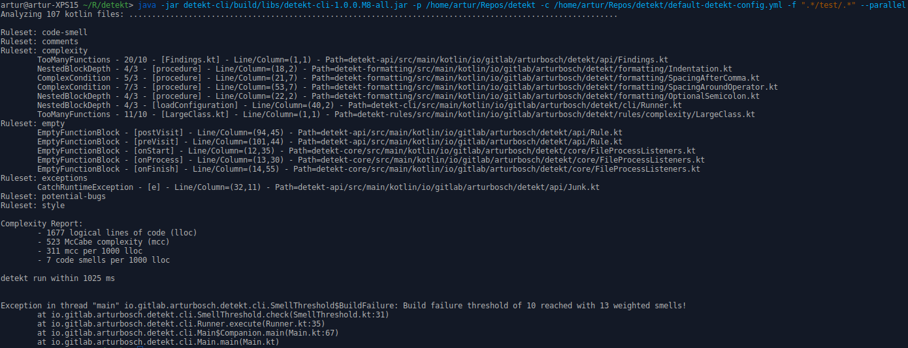

# detekt

[](https://kotlinlang.slack.com/archives/C88E12QH4)
[](https://detekt.dev/)
[](https://search.maven.org/artifact/io.gitlab.arturbosch.detekt/detekt-cli)
[](https://plugins.gradle.org/plugin/io.gitlab.arturbosch.detekt)
[](https://ge.detekt.dev/scans)
[](LICENSE)


[](https://codecov.io/gh/detekt/detekt)
[](https://github.com/KotlinBy/awesome-kotlin)
[](https://app.fossa.com/projects/custom%2B25591%2Fgithub.com%2Fdetekt%2Fdetekt?ref=badge_small)

Meet _detekt_, a static code analysis tool for the [_Kotlin_ programming language](https://kotlinlang.org/).
Visit [the project website](https://detekt.dev/) for installation guides, rule descriptions, configuration options and more.



### Features

- Code smell analysis for your [Kotlin](https://kotlinlang.org/) projects.
- Highly configurable rule sets.
- Generate baselines to suppress existing issues for legacy projects while making sure no new issues are introduced.
- Suppress issues in source files using `@Suppress` annotations.
- Support for different report formats: HTML, Markdown, [SARIF](https://sarifweb.azurewebsites.net/), XML (Checkstyle) and custom reports.
- [Extend detekt](https://detekt.dev/docs/introduction/extensions) with custom rule sets and reports.
- Complexity reports based on lines of code, cyclomatic complexity and number of code smells.
- First party integration with Gradle with our [Gradle plugin](#with-gradle).
- A community of [third party plugins](https://github.com/topics/detekt-plugin) that adds more rules and features to detekt.

#### Quick-Links

- [Changelog and migration guides](https://detekt.dev/changelog.html)
- [Available CLI options](https://detekt.dev/cli.html)
- [Rule set and rule descriptions](https://detekt.dev/complexity.html)
- [Writing custom rules and extending detekt](https://detekt.dev/docs/introduction/extensions/)
- [Suppressing issues in code](https://detekt.dev/suppressing-rules.html)
- [Suppressing issues via baseline file](https://detekt.dev/baseline.html)
- [Configuring detekt](https://detekt.dev/configurations.html)
- Sample Gradle integrations examples:
    - [multi project (Kotlin DSL)](https://github.com/detekt/detekt/blob/main/build.gradle.kts)
    - [single project (Groovy DSL)](https://github.com/arturbosch/kutils/blob/master/build.gradle)
    - [single project (Unofficial Maven plugin)](https://github.com/detekt/sonar-kotlin/blob/main/pom.xml)

### Quick Start ...

#### with the command-line interface

```sh
curl -sSLO https://github.com/detekt/detekt/releases/download/v[version]/detekt-cli-[version]-all.jar
java -jar detekt-cli-[version]-all.jar --help
```

You can find [other ways to install detekt here](https://detekt.dev/cli.html)

#### with Gradle

```kotlin
plugins {
    id("io.gitlab.arturbosch.detekt") version "[version]"
}

repositories {
    mavenCentral()
}

detekt {
    buildUponDefaultConfig = true // preconfigure defaults
    allRules = false // activate all available (even unstable) rules.
    config.setFrom("$projectDir/config/detekt.yml") // point to your custom config defining rules to run, overwriting default behavior
    baseline = file("$projectDir/config/baseline.xml") // a way of suppressing issues before introducing detekt
}

tasks.withType<Detekt>().configureEach {
    reports {
        html.required.set(true) // observe findings in your browser with structure and code snippets
        xml.required.set(true) // checkstyle like format mainly for integrations like Jenkins
        sarif.required.set(true) // standardized SARIF format (https://sarifweb.azurewebsites.net/) to support integrations with GitHub Code Scanning
        md.required.set(true) // simple Markdown format
    }
}

// Groovy DSL
tasks.withType(Detekt).configureEach {
    jvmTarget = "1.8"
}
tasks.withType(DetektCreateBaselineTask).configureEach {
    jvmTarget = "1.8"
}

// or

// Kotlin DSL
tasks.withType<Detekt>().configureEach {
    jvmTarget = "1.8"
}
tasks.withType<DetektCreateBaselineTask>().configureEach {
    jvmTarget = "1.8"
}
```

See [maven central](https://search.maven.org/artifact/io.gitlab.arturbosch.detekt/detekt-cli) for releases and [sonatype](https://oss.sonatype.org/#view-repositories;snapshots~browsestorage~io/gitlab/arturbosch/detekt) for snapshots.

If you want to use a SNAPSHOT version, you can find more info on [this documentation page](https://detekt.dev/snapshots.html).

#### Requirements

Gradle 6.8.3+ is the minimum requirement. However, the recommended versions together with the other tools recommended versions are:

| Detekt Version | Gradle | Kotlin   | AGP     | Java Target Level | JDK Max Version |
|----------------|--------|----------|---------|-------------------|-----------------|
| `1.23.6`       | `8.7`  | `1.9.23` | `8.3.1` | `1.8`             | `17`            |

The list of [recommended versions for previous detekt version is listed here](https://detekt.dev/compatibility.html).

### Adding more rule sets

detekt itself provides a wrapper over [ktlint](https://github.com/pinterest/ktlint) as the `formatting` rule set
which can be easily added to the Gradle configuration:

```kotlin
dependencies {
    detektPlugins("io.gitlab.arturbosch.detekt:detekt-formatting:[version]")
}
```

Similarly, there are extra rule sets available for detekt from detekt:
```kotlin
dependencies {
    detektPlugins("io.gitlab.arturbosch.detekt:detekt-rules-libraries:[version]")
    detektPlugins("io.gitlab.arturbosch.detekt:detekt-rules-ruleauthors:[version]")
}
```
For more info visit the [Detekt Marketplace](https://detekt.dev/marketplace).

Likewise custom [extensions](https://detekt.dev/docs/introduction/extensions/) can be added to detekt.

### Contributing

See [CONTRIBUTING](.github/CONTRIBUTING.md)

Thanks to all the people who contributed to detekt!

[](https://github.com/detekt/detekt/graphs/contributors)

### Mentions

[](http://androidweekly.net/issues/issue-259)
[](http://androidweekly.cn/android-dev-wekly-issue-154/)

As mentioned in...

- [To Detekt 2.0, and beyond!](https://www.youtube.com/watch?v=6EQd_SDR6n0)
- [droidcon London 2021 - Detekt - State of the Union](https://www.droidcon.com/2021/11/17/detekt-state-of-the-union-2/)
- [KotlinConf 2018 - Safe(r) Kotlin Code - Static Analysis Tools for Kotlin by Marvin Ramin](https://www.youtube.com/watch?v=yjhQiP0329M)
- [droidcon NYC 2018 - Static Code Analysis For Kotlin](https://www.youtube.com/watch?v=LT6m5_LO2DQ)
- Kotlin on Code Quality Tools - by @vanniktech [Slides](https://docs.google.com/presentation/d/1sUoQCRHTR01JfaS67Qkd7K1rdRLOhO6QGCelZZwxOKs/edit) [Presentation](https://www.youtube.com/watch?v=FKDNE6PPTTE)
- [Integrating detekt in the Workflow](https://www.raywenderlich.com/24470020-integrating-detekt-in-the-workflow)
- [Check the quality of Kotlin code](https://blog.frankel.ch/check-quality-kotlin-code/)
- [Kotlin Static Analysis Tools](http://smyachenkov.com/posts/kotlin-static-analysis-tools/)
- [Are you still smelling it?: A comparative study between Java and Kotlin language](https://doi.org/10.1145/3267183.3267186) by [Flauzino et al.](https://github.com/matheusflauzino/smells-experiment-Kotlin-and-Java)
- [Preventing software antipatterns with Detekt](https://galler.dev/preventing-software-antipatterns-with-detekt/)

Integrations:

- [IntelliJ integration](https://github.com/detekt/detekt-intellij-plugin)
- [SonarQube integration](https://docs.sonarsource.com/sonarqube/latest/analyzing-source-code/importing-external-issues/external-analyzer-reports/)
- [TCA(Tencent CodeAnalysis) integration](https://github.com/Tencent/CodeAnalysis/blob/main/client/tool/detekt.py)
- [Codacy](https://www.codacy.com)
- [Gradle plugin that configures Error Prone, Checkstyle, PMD, CPD, Lint, Detekt & Ktlint](https://github.com/vanniktech/gradle-code-quality-tools-plugin)
- [Violations Lib](https://github.com/tomasbjerre/violations-lib) is a Java library for parsing report files like static code analysis.
- [sputnik](https://github.com/TouK/sputnik) is a free tool for static code review and provides support for detekt
- [Detekt Maven plugin](https://github.com/Ozsie/detekt-maven-plugin) that wraps the Detekt CLI
- [Detekt Bazel plugin](https://github.com/buildfoundation/bazel_rules_detekt) that wraps the Detekt CLI
- [Gradle plugin that helps facilitate GitHub PR checking and automatic commenting of violations](https://github.com/btkelly/gnag)
- [Codefactor](http://codefactor.io/)
- [GitHub Action: Detekt All](https://github.com/marketplace/actions/detekt-all)
- [GitHub Action: Setup detekt](https://github.com/marketplace/actions/setup-detekt)

Custom rules and reports from 3rd parties can be found on our [**Detekt Marketplace**](https://detekt.dev/marketplace).

#### Credits

- [JetBrains](https://github.com/jetbrains/) - Creating IntelliJ + Kotlin
- [PMD](https://github.com/pmd/pmd) & [Checkstyle](https://github.com/checkstyle/checkstyle) & [ktlint](https://github.com/pinterest/ktlint) - Ideas for threshold values and style rules
