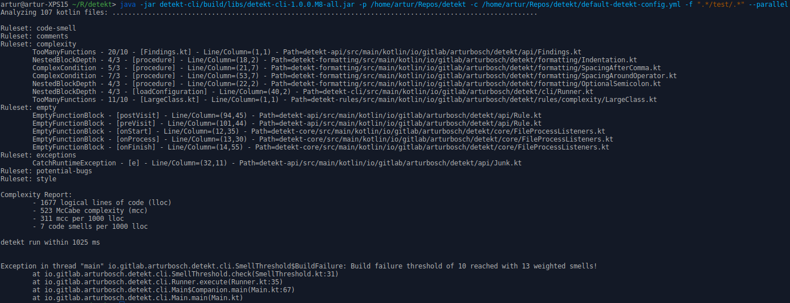

### Features

- Code smell analysis for your Kotlin projects
- Complexity report based on logical lines of code, McCabe complexity and amount of code smells
- Highly configurable (rule set or rule level)
- Suppress findings with Kotlin's `@Suppress` and Java's `@SuppressWarnings` annotations
- Specify code smell thresholds to break your build or print a warning
- Code Smell baseline and ignore lists for legacy projects
- [Gradle plugin](#gradleplugin) for code analysis via Gradle builds
- Gradle tasks to use local `IntelliJ` distribution for [formatting and inspecting](#idea) Kotlin code
- Optionally configure detekt for each sub module by using [profiles](#closure) (gradle-plugin)
- [SonarQube integration](https://github.com/arturbosch/sonar-kotlin)
- Extensible by own rule sets and `FileProcessListener's`
- [IntelliJ integration](https://github.com/detekt/detekt-intellij-plugin)
- Unofficial [Maven plugin](https://github.com/Ozsie/detekt-maven-plugin) by [Ozsie](https://github.com/Ozsie)

### Quick Start with Gradle

Apply the following configuration to your Gradle project build file:

```kotlin
buildscript {
    repositories {
        jcenter()
    }
}

plugins {
    id("io.gitlab.arturbosch.detekt").version("{{ site.detekt_version }}")
}

repositories {
    jcenter()
}
```

The format is very similar if you use the Gradle Groovy DSL. You can find what is the **latest version of detekt** in
the [release notes](/detekt/changelog.html).

Once you have set up detekt in your project, simply run `gradle detekt`.

To change the default behaviour of detekt rules, first generate yourself a detekt configuration file by running the
`detektGenerateConfig` task and applying any changes to the generated file.

Don't forget to reference the newly generated config inside the `detekt { }` closure. Optionally, it is possible to
slim down the configuration file to only the changes from the default configuration, by applying the
`buildUponDefaultConfig` option:

```kotlin
detekt {
    toolVersion = "{{ site.detekt_version }}"
    config = files("config/detekt/detekt.yml")
    buildUponDefaultConfig = true
}
```

To enable/disable detekt reports and to configure their output directories edit the `detekt { }` closure:
```kotlin
detekt {
    reports {
        xml {
            enabled = true
            destination = file("path/to/destination.xml")
        }
        html {
            enabled = true
            destination = file("path/to/destination.html")
        }
        txt {
            enabled = true
            destination = file("path/to/destination.txt")
        }
    }
}
```

### Adding more rule sets

detekt itself provides a wrapper over [ktlint](https://github.com/pinterest/ktlint) as a `formatting` rule set
which can be easily added to the gradle configuration:

```gradle
dependencies {
    detektPlugins "io.gitlab.arturbosch.detekt:detekt-formatting:{{ site.detekt_version }}"
}
```

Likewise custom [extensions](https://arturbosch.github.io/detekt/extensions.html) can be added to detekt.


