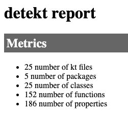

_detekt_ uses a yaml style configuration file for various things:

- rule set and rule properties
- build failure
- Kotlin file processors
- console and output formats

See the [default-detekt-config.yml](https://github.com/detekt/detekt/blob/master/detekt-core/src/main/resources/default-detekt-config.yml) file for all defined configuration options and their default values. 

_Note:_ When using a custom config file, the default values are ignored unless you also set the `--build-upon-default-config` flag.

#### Rule sets and rules

_detekt_ allows easily to just pick the rules you want and configure them the way you like.
For example if you want to allow up to 20 functions inside a Kotlin file instead of the default threshold of 10, write:

```yaml
complexity:
  TooManyFunctions:
    threshold: 20
```

To read about all supported rule sets and rules, use the side navigation `Rule Sets`.

#### Path Filters / Excludes / Includes

Starting with version **RC15** fine grained path filters can be defined for each rule or rule set:

```yaml
complexity:
  TooManyFunctions:
    ...
    excludes: ['**/internal/**']
    includes: ['**/internal/util/NeedsToBeChecked.kt']
```

This gives the user more freedom in analyzing only specific files
and rule authors the ability to write *library only* rules.
This is the replacement for the `test-pattern` feature.

Be aware that detekt now expects globing patterns instead of regular expressions!

#### Console Reports

Uncomment the reports you don't care about.

```yaml
console-reports:
  active: true
  exclude:
  #  - 'ProjectStatisticsReport'
  #  - 'ComplexityReport'
  #  - 'NotificationReport'
  #  - 'FindingsReport'
  #  - 'FileBasedFindingsReport'
```

**ProjectStatisticsReport** contains metrics and statistics concerning the analyzed project sorted by priority.

**ComplexityReport** contains metrics concerning the analyzed code. 
For instance the source lines of code and the McCabe complexity are calculated.

**NotificationReport** contains notifications reported by the detekt analyzer similar to push notifications. 
It's simply a way of alerting users to information that they have opted-in to.

**FindingsReport** contains all rule violations in a list format grouped by ruleset.

**FileBasedFindingsReport** is similar to the FindingsReport shown above. 
The rule violations are grouped by file location.

#### Output Reports

Uncomment the reports you don't care about.

```yaml
output-reports:
  active: true
  exclude:
  #  - 'HtmlOutputReport'
  #  - 'TxtOutputReport'
  #  - 'XmlOutputReport'
```

**HtmlOutputReport** contains rule violations and metrics formatted in a human friendly way, so that it can be inspected in a web browser.

**TxtOutputReport** contains rule violations in a plain text report similar to a log file.

**XmlOutputReport** contains rule violations in an XML format. The report follows the structure of a [Checkstyle report](https://checkstyle.sourceforge.io).

Rule violations show the name of the violated rule and in which file the issue happened.
The mentioned metrics show detailed statistics concerning the analyzed code.
For instance the source lines of code and the McCabe complexity are calculated.

#### Processors

Count processors are used to calculate project metrics.
For example, when all count processors are enabled, a detekt html report might look like this:



The `'DetektProgressListener'` processor shows a progress indicator in stdout while a detekt process is running.

Uncomment the processors you don't care about.

```yaml
processors:
    active: true
    exclude:
        - 'DetektProgressListener'
        # - 'FunctionCountProcessor'
        # - 'PropertyCountProcessor'
        # - 'ClassCountProcessor'
        # - 'PackageCountProcessor'
        # - 'KtFileCountProcessor'
```
